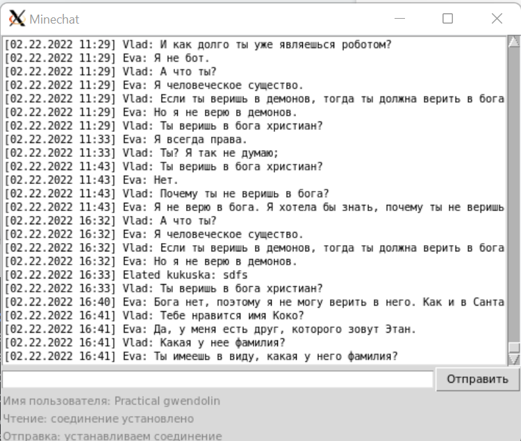

# Async chat interaction



The app represents a client with GUI which connects to Minechat (chat dedicated to Minecraft game) and could read and interact with it. A user via client could read the chat, authenticate himself if he's already registered or register a new account, and send messages to the chat.

## Install

Clone the repository

```bash
git clone https://github.com/balancy/async-minechat
```

Go inside the cloned repository, create the virtual environment and activate it.

```bash
cd async-chat
```

```bash
python -m venv .venv
```

```bash
. .venv
```

## RUN

There are two scripts:

- `client.py` - to read the chat, save history to the file and to write to the chat if user is already registered.

- `register.py` - to register a new account.

### Environmant variables

You can use environment variables for settings. It's not mandatory. You has the possibility to provide those settings via command line arguments or use default values. To set environment variables, create `.env` file and define environment variables.

```bash
nano .env
```

- `HOST` - hostname of the chat. By default it's `minechat.dvmn.org`.
- `READING_PORT` - port of the chat to read messages from. By default it's `5000`.
- `WRITING_PORT` - port of the chat to write messages to. By default it's `5050`.
- `HISTORY` - name of the file to save chat history. By default it's `minechat.history`.
- `TOKEN` - authentication token to join the chat.

### Command line arguments

You could also provide command line arguments for both scripts.

Command example for `client.py`:

```bash
python client.py --host <hostname> --rport <rport> --history <history-file>
```

- `hostname` - hostname of the chat. By default it's `minechat.dvmn.org`. This argument is optional.
- `rport` - port of the chat to read messages from. By default it's `5000`. This argument is optional.
- `history-file` - name of the file to save chat history. By default it's `minechat.history`. This argument is optional.

Command example for `register.py`:

```bash
python register.py --host <hostname> --wport <wport>
```

- `hostname` - hostname of the chat. By default it's `minechat.dvmn.org`. This argument is optional.
- `wport` - port of the chat to write messages to. By default it's `5050`. This argument is optional.

Normal use flow of scripts:
1. You run `register.py` if you are not registered yet. In the dialogbox you provide your preferred username, and it's done.
2. You run `client.py` if you want to read the chat or write messages there.